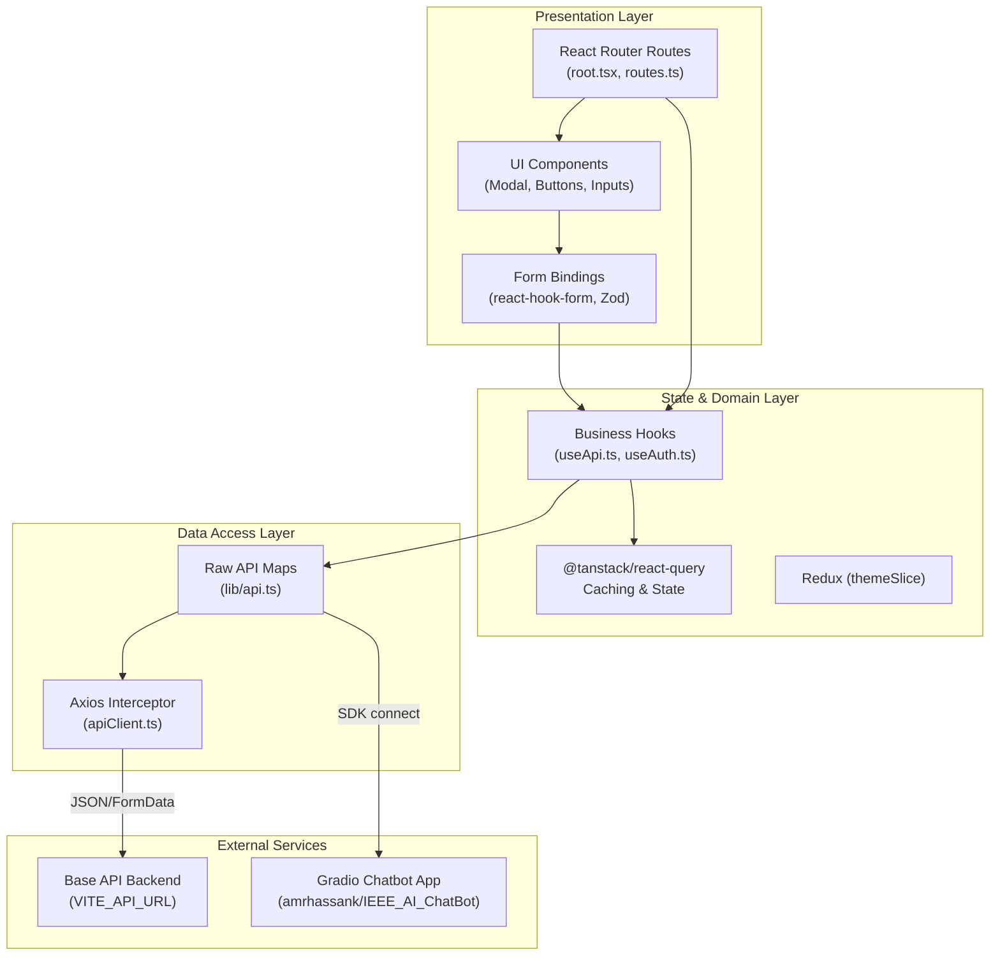
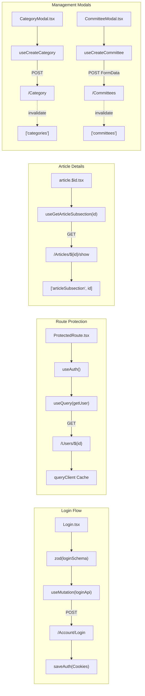

# Architecture and Dataflow Graphs

```mermaid
flowchart TD
    subgraph Presentation ["Presentation Layer"]
        Routes["React Router Routes\n(root.tsx, routes.ts)"]
        Components["UI Components\n(Modal, Buttons, Inputs)"]
        Forms["Form Bindings\n(react-hook-form, Zod)"]

        Routes --> Components
        Components --> Forms
    end

    subgraph StateAndDomain ["State & Domain Layer"]
        Hooks["Business Hooks\n(useApi.ts, useAuth.ts)"]
        QueryClient["@tanstack/react-query\nCaching & State"]
        Redux["Redux (themeSlice)"]

        Forms --> Hooks
        Routes --> Hooks
        Hooks --> QueryClient
    end

    subgraph DataAccess ["Data Access Layer"]
        APIClient["Axios Interceptor\n(apiClient.ts)"]
        APIFunctions["Raw API Maps\n(lib/api.ts)"]

        Hooks --> APIFunctions
        APIFunctions --> APIClient
    end


    subgraph External ["External Services"]
        BackendAPI["Base API Backend\n(VITE_API_URL)"]
        GradioAI["Gradio Chatbot App\n(amrhassank/IEEE_AI_ChatBot)"]

        APIClient -->|JSON/FormData| BackendAPI
        APIFunctions -->|SDK connect| GradioAI
    end
```

## Detailed Dataflow Mapping (Mermaid)

```mermaid
flowchart LR
    %% 1. Auth Flow
    subgraph Auth ["Login Flow"]
        UI_Login["Login.tsx"] --> Form_Login["zod(loginSchema)"]
        Form_Login --> Hook_Login["useMutation(loginApi)"]
        Hook_Login -->|POST| End_Login["/Account/Login"]
        End_Login --> Cache_Login["saveAuth(Cookies)"]
    end

    %% 2. Protected Route Flow
    subgraph Protection ["Route Protection"]
        UI_Protected["ProtectedRoute.tsx"] --> Hook_Auth["useAuth()"]
        Hook_Auth --> Hook_QueryUser["useQuery(getUser)"]
        Hook_QueryUser -->|GET| End_User["/Users/${id}"]
        End_User --> Cache_User["queryClient Cache"]
    end

    %% 3. Articles Flow
    subgraph Articles ["Article Details"]
        UI_Article["article.$id.tsx"] --> Hook_Article["useGetArticleSubsection(id)"]
        Hook_Article -->|GET| End_Article["/Articles/${id}/show"]
        End_Article --> Cache_Article["['articleSubsection', id]"]
    end

    %% 4. Entities Management Edge List
    subgraph Management ["Management Modals"]
        UI_CatModal["CategoryModal.tsx"] --> Hook_Cat["useCreateCategory"]
        Hook_Cat -->|POST| End_Cat["/Category"]
        End_Cat -.->|invalidate| Cache_Cat["['categories']"]

        UI_ComModal["CommitteeModal.tsx"] --> Hook_Com["useCreateCommittee"]
        Hook_Com -->|POST FormData| End_Com["/Committees"]
        End_Com -.->|invalidate| Cache_Com["['committees']"]
    end
```
